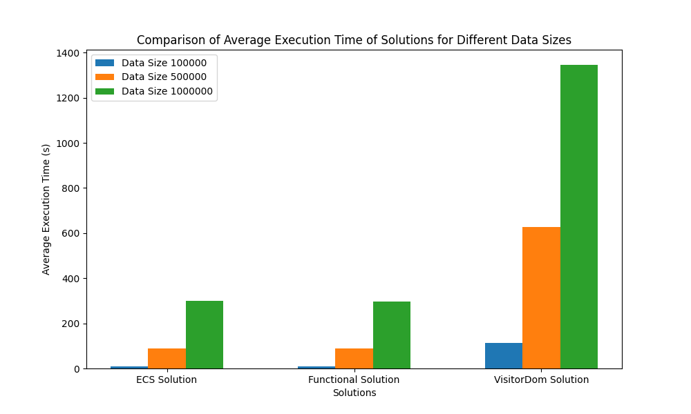
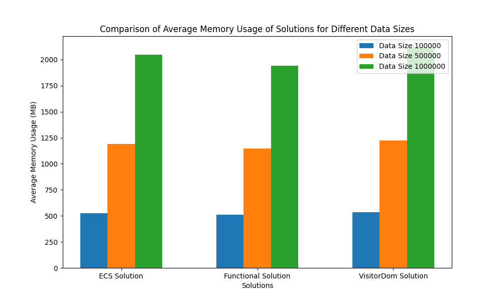

# Entity Component System (ECS) Architecture for Big Data and AI Pipelines: Performance Tests

This project aims to propose and evaluate the performance of the Entity Component System (ECS) architecture for Big Data and AI pipelines. The ECS architecture is compared to a traditional object-oriented programming (OOP) solution that combines the Visitor design pattern and Dynamic Object Model (DOM) pattern. The goal is to understand how the ECS architecture (in both its OOP and functional variants) performs relative to these traditional methods in terms of execution time and memory usage under varying data sizes.

## Overview

### ECS Architecture

The Entity Component System (ECS) architecture is a design pattern that separates data (components) from behavior (systems) using entities as unique identifiers that associate with various components. Originally popular in game development, ECS is highly suitable for big data and AI applications due to its flexibility, scalability, and performance optimization capabilities.
ECS Components

- Entity: A unique identifier, typically an integer or UUID, that links various components together without containing data or behavior.

- Component: A plain data structure that holds the data necessary for systems to function. Components are devoid of logic.

- System: Contains the logic that operates on the components. Systems query entities with specific components, perform operations on the data, and update component states.

### ECS Design Pattern Benefits

- Separation of Data and Logic: Enhances manageability and scalability.
- Flexibility: Components can be added, removed, or modified independently.
- Performance: Systems are optimized for performance, improving memory layout and cache efficiency.

### Visitor + DOM Solution

The Visitor design pattern combined with the Dynamic Object Model (DOM) pattern is a traditional OOP solution aimed at achieving similar flexibility and scalability as ECS. The Visitor pattern allows operations to be performed on elements of an object structure without changing the classes on which it operates, while the DOM pattern provides a way to represent and interact with structured data.

## Solutions Tested
1. **ECS-OOP (Entity-Component-System Object Oriented Programming) Solution**
2. **ECS-Functional Solution**
3. **Visitor + DOM (Dynamic Object Model) Solution**

## Features
- Performance metrics: execution time and memory usage.
- Cyclomatic complexity analysis using Radon.
- Detailed reports and visualizations of the results.
- Automatic cache clearing after each test to ensure clean testing conditions.

## Prerequisites
Make sure you have the following libraries installed in your Python environment:
- numpy
- pandas
- matplotlib
- psutil
- torch
- radon

You can install them using `pip`:
```bash
pip install numpy pandas matplotlib psutil torch radon
```

## Directory Structure
- `solutions_in_test/`: Contains the implementation files for the solutions to be tested (`ecs_oop_solution.py`, `ecs_functional_solution.py`, `visitor_dom_solution.py`).
- `images/`: Directory where the generated images (histograms and tables) will be saved.
- `reports/`: Directory where the detailed reports will be saved.

## Running the Experiment
To run the experiment, use the following command:

```bash
python exec_experiment.py --repetitions <number_of_repetitions> --test_data_sizes <data_size1> <data_size2> <data_sizeN> --memory_limit <memory_limit_in_MB> --max_workers <number_of_workers> --verbose
```

### Arguments
- `--repetitions`: Number of repetitions for each test (default: 5).
- `--test_data_sizes`: List of test data sizes (default: [1000, 10000, 100000]).
- `--memory_limit`: Memory limit in MB (default: 40000).
- `--max_workers`: Maximum number of concurrent workers (default: 4).
- `--verbose`: Enable verbose logging.

### Example
```bash
python exec_experiment.py --repetitions 5 --test_data_sizes 100000 500000 1000000 --memory_limit 40000 --max_workers 4 --verbose
```

## Output
The experiment generates the following outputs:
1. **Images**:
   - Histograms and tables showing the average execution time and memory usage for each solution at different data sizes.
   - Saved in the `images/` directory.

2. **Reports**:
   - A detailed text file containing system information, test parameters, cyclomatic complexity analysis, and the results of the tests.
   - Saved in the `reports/` directory with a timestamp in the filename.

## System Information
The script also logs detailed system information, including:
- System details (OS, node name, release, version, machine type, processor).
- CPU details (number of cores and logical CPUs).
- Memory details (total and available memory, memory usage percentage).
- Disk details (total, used, and free disk space, disk usage percentage).
- RAM speed.
- GPU information.

## Cyclomatic Complexity Analysis
The script uses Radon to perform a cyclomatic complexity analysis on the solution files. The results are included in the final report.

## Clear Cache Function
To ensure clean testing conditions, the script includes a `clear_cache` function that clears the memory cache after each test run.

## Test Framework Architecture
The test framework is architected to ensure robust and efficient testing of multiple solutions under varying conditions. Here's an overview of its architecture:

### Main Components
1. **Data Generation**: Generates random transaction data and user profiles for testing.
2. **Module Loading**: Dynamically loads the solution modules to be tested.
3. **Test Execution**: Uses `concurrent.futures.ProcessPoolExecutor` to run tests in parallel, leveraging multiple CPU cores for efficiency.
4. **Result Collection**: Collects and aggregates results (execution time and memory usage) from each test run.
5. **Cache Clearing**: Ensures that memory cache is cleared after each test run to prevent cross-test contamination.
6. **Cyclomatic Complexity Analysis**: Analyzes the complexity of each solution using Radon before the tests begin.
7. **Reporting**: Generates and saves detailed reports and visualizations of the test results.

### Workflow
1. **Initialization**: Set up logging, create necessary directories, and print system information.
2. **Cyclomatic Complexity Analysis**: Run Radon analysis on the solution files and store the results.
3. **Test Execution**: For each data size:
   - Generate test data.
   - Execute tests for each solution using a process pool.
   - Collect and aggregate results.
   - Clear cache after each test.
4. **Result Aggregation**: Compute average execution time and memory usage for each solution and data size.
5. **Visualization**: Generate histograms and tables for the results.
6. **Reporting**: Save a detailed report with system information, test parameters, complexity analysis, and results.

### Clear Cache Function
The `clear_cache` function is essential for ensuring that each test run starts with a clean slate:
```python
def clear_cache():
    gc.collect()
    if torch.cuda.is_available():
        torch.cuda.empty_cache()
```

### Example Functions
Here’s an example of how the `run_test_in_process` function works:
```python
def run_test_in_process(test_function, transaction_data, user_profiles, verbose, memory_limit):
    process_name = multiprocessing.current_process().name
    if verbose:
        logging.debug(f'Starting process {process_name}')
    try:
        start_time = perf_counter()
        result = test_function(transaction_data, user_profiles)
        end_time = perf_counter()
        memory_usage = psutil.Process().memory_info().rss / (1024 ** 2)  # In MB
        if memory_usage > memory_limit:
            logging.warning(f'Memory usage exceeded: {memory_usage}MB > {memory_limit}MB in process {process_name}')
        if verbose:
            logging.debug(f'Completed process {process_name} with result: {result}, Memory Usage: {memory_usage}MB, Time: {end_time - start_time}s')
        return (result, memory_usage, end_time - start_time)
    except Exception as e:
        logging.error(f'Error in process {process_name}: {e}')
        return (None, None, None)
    finally:
        clear_cache()
```

## Summary of Results
Below is a summary of the performance results:

### Average Execution Time (s) for each data size:

**Data Size 100000:**
- ECS-OOP Solution: 9.662471744400682
- ECS-Functional Solution: 8.873416131199338
- Visitor-Dom Solution: 114.17536794459738

**Data Size 500000:**
- ECS-OOP Solution: 89.64561372399912
- ECS-Functional Solution: 89.8852030990005
- Visitor-Dom Solution: 625.7463480404025

**Data Size 1000000:**
- ECS-OOP Solution: 300.29948763780123
- ECS-Functional Solution: 295.6874681459973
- Visitor-Dom Solution: 1345.666377384594

### Average Memory Usage (MB) for each data size:

**Data Size 100000:**
- ECS-OOP Solution: 524.4390625
- ECS-Functional Solution: 510.64609375
- Visitor-Dom Solution: 535.1984375

**Data Size 500000:**
- ECS-OOP Solution: 1189.46953125
- ECS-Functional Solution: 1146.3734375
- Visitor-Dom Solution: 1221.946875

**Data Size 1000000:**
- ECS-OOP Solution: 2048.28984375
- ECS-Functional Solution: 1943.6796875
- Visitor-Dom Solution: 2119.6625

## Visualizations
The following image shows the comparison of average execution times for different data sizes across all tested solutions:





## Summary of Results

The performance evaluation of the ECS architecture (both OOP and functional variants) against the Visitor + DOM solution reveals significant insights:

- **ECS-OOP Solution**:
  - Exhibits steady performance with an average execution time of 9.66 seconds for 100,000 data points, scaling to 300.30 seconds for 1,000,000 data points.
  - Shows a consistent increase in memory usage from 524.44 MB for 100,000 data points to 2048.29 MB for 1,000,000 data points.

- **ECS-Functional Solution**:
  - Performs similarly to the ECS-OOP solution with an average execution time of 8.87 seconds for 100,000 data points, scaling to 295.69 seconds for 1,000,000 data points.
  - Demonstrates efficient memory usage, starting at 510.65 MB for 100,000 data points and reaching 1943.68 MB for 1,000,000 data points.

- **Visitor + DOM Solution**:
  - Significantly slower in comparison, with an average execution time of 114.18 seconds for 100,000 data points and a substantial increase to 1345.67 seconds for 1,000,000 data points.
  - Higher memory usage, from 535.20 MB for 100,000 data points to 2119.66 MB for 1,000,000 data points.

These results indicate that both ECS-OOP and ECS-Functional solutions outperform the Visitor + DOM solution in terms of execution time and memory efficiency as data size increases. This demonstrates the scalability and performance benefits of the ECS architecture for big data and AI pipelines.

## Contributing
Feel free to contribute to this project by adding new solutions or improving the existing ones. Make sure to update the README and provide clear documentation for any changes made.

## License
This project is licensed under the MIT License. See the LICENSE file for more details.
